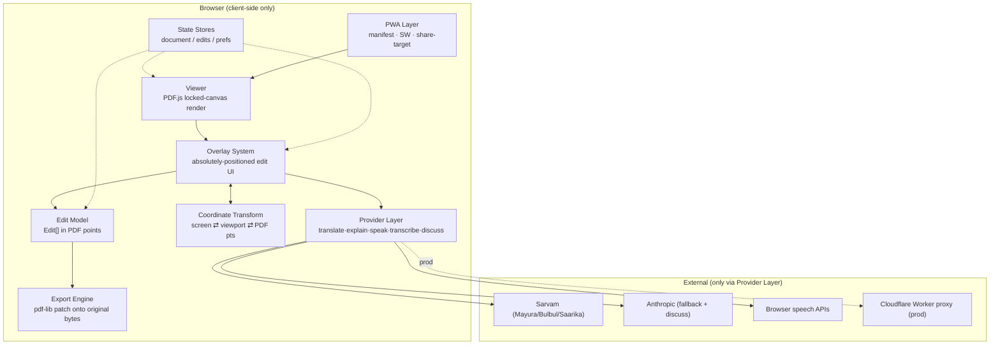
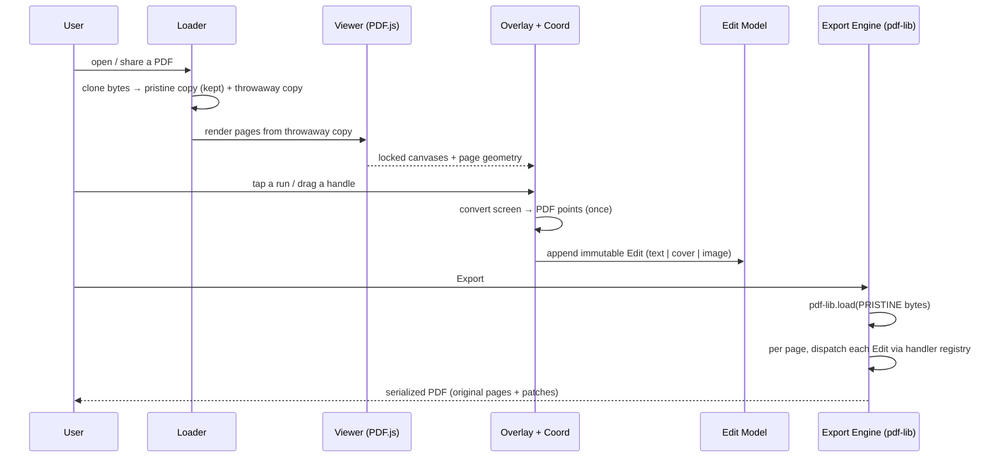
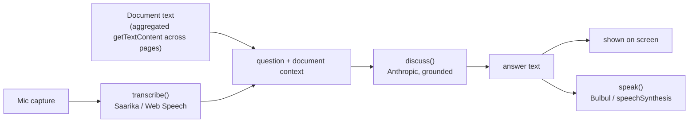
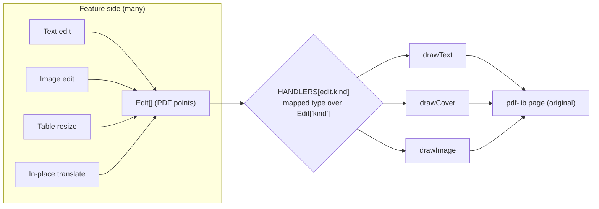

# DesiPDF — Architecture

*A pure architecture document. No tasks, phases, timelines, or checklists — only the shape of
the system, its invariants, and its hard parts.*

---

## 1. System Overview & Core Promise

DesiPDF is a **100% client-side, browser-based PDF editor** with an Indian-language reader layer.
It lets a user open any PDF and edit text, manipulate images, widen table columns, translate runs
into Indian languages, or discuss the document by voice — then download a clean PDF.

**The core promise is a single sentence: _layout never shifts._**

Every architectural decision descends from that promise. A word processor or a "PDF-to-editable"
converter re-typesets the document and inevitably reflows it. DesiPDF refuses to reconstruct the
document at all. Instead:

- The **original PDF is rendered as a locked raster background** and treated as immutable truth.
- Every edit is an **absolutely-positioned overlay** floating over that background.
- **Export re-opens the original bytes** and stamps patches onto the original pages — it never
  regenerates or re-lays-out anything.

The result: what the user sees is always the real document with edits composited on top, and what
they download is the real document with those same edits drawn into it at identical coordinates.

**Trust & deployment model.** There is no backend for document handling, no database, no accounts.
The PDF never leaves the device for rendering, editing, or export. The *only* data that crosses the
network is text/audio sent to AI providers for translation and voice discussion, and that traffic is
funnelled through one narrow seam (the Provider Layer). The app ships as an installable PWA.

---

## 2. Architectural Principles

1. **Never reconstruct.** The document is a fixed substrate; the app only ever *adds* overlays and,
   on export, *patches*. No reflow, no re-typesetting, no page regeneration.
2. **One direction of flow.** UI produces immutable `Edit` descriptions; the export engine consumes
   them. Editing never talks to pdf-lib; exporting never talks to the DOM.
3. **One coordinate truth.** All edits are stored in PDF user-space points. Screen↔PDF conversion
   happens at exactly one boundary, at edit-creation time.
4. **The render is truth for pixels.** Background colors and moved-image pixels are sampled from the
   locked raster, never inferred from the DOM or the PDF's internal color model.
5. **Complex scripts are images.** Indic text is shaped by the browser and embedded as a raster
   patch; it is never handed to a text-drawing API that cannot shape it.
6. **Narrow external surface.** All AI I/O passes through one provider interface with deterministic
   failover; production carries no secrets in the client.

---

## 3. Major Components



### 3.1 Viewer (render layer)
Loads the PDF with **PDF.js** and renders each page to its own `<canvas>` at `renderScale = zoom ×
devicePixelRatio`. Each canvas is a **locked background** — nothing mutates it after render. The
viewer owns canvas sizing exclusively (backing store in device px, CSS box divided by dpr), so the
overlay layer can trust a single, well-defined pixel geometry. A "hold-to-peek" affordance hides all
overlays to reveal the untouched original.

### 3.2 Overlay System
The only interactive surface. Each edit renders as an absolutely-positioned DOM element (a
`contenteditable` for text, a draggable frame for images, guide handles for tables, a popover for
translate/meaning/search). Overlays derive their on-screen geometry **only** through the Coordinate
Transform — never by re-measuring the canvas — so they stay pinned to the glyphs under zoom and dpr
changes.

### 3.3 Edit Model
A small, closed, discriminated union of immutable `Edit` objects (`text | cover | image`), each
carrying a page index, a rectangle **in PDF points**, and a z-order. This is the contract between the
UI and the export engine (see §5). Features are expressed as compositions of these primitives — a
text change is a *cover* patch plus a *text* overlay; a moved image or a widened table column are all
just sequences of the same three kinds.

### 3.4 Export Engine
Re-opens the **pristine original bytes** with **pdf-lib**, groups edits by page, and draws each one
onto its original page through a handler registry, then serializes. Text is drawn with **pdf-lib standard
fonts**, chosen by mapping the source font name to a serif/sans/mono family with bold/italic, warning on any
substitution. Cover patches sample their fill color from the locked raster. The engine never regenerates
pages; it only stamps onto them. *(Indian-language text is never rendered into the PDF — see §6.)*

### 3.5 Coordinate Transform
A single module that converts between three spaces — screen CSS px, PDF.js viewport px, and PDF
points — and is the *only* place that conversion is allowed to happen. PDF.js's own
`convertToPdfPoint` is the source of truth (it handles page rotation); closed-form transforms are
kept as a cross-checked fallback. Because edits are stored in PDF points, the export side of this
transform is nearly the identity, which keeps the export engine simple and stable.

### 3.6 Indian-language support (voice, not rendering)
DesiPDF does **not** render Hindi/Tamil text into the document (that would require rasterizing shaped Indic
runs to image patches — cut from scope: non-selectable, memory-heavy, delicate). Instead, Indian-language
support is **spoken**: the Provider Layer explains/translates a tapped block and speaks it in the user's
preferred language (§6, §7). No fonts are bundled; nothing Indic is embedded in the exported PDF.

### 3.7 Provider Layer (with voice discussion)
One interface — `translate`, `explain`, `speak`, `transcribe`, `discuss` — behind which live
concrete providers: **Sarvam** (primary: Mayura translation, Bulbul TTS, Saarika ASR incl.
code-mixed Hinglish), **Anthropic** (translation/explanation fallback and the engine for
document-grounded voice discussion), and **Browser** (offline `speechSynthesis` / Web Speech API).
A **Bhashini** provider exists as a stub. The layer applies a fixed, silent, logged failover order.
Voice discussion is a *composition* of this interface: `transcribe` → `discuss` → `speak`.

### 3.8 PWA Layer
A manifest, a service worker, and a **Web Share Target** so the installed app appears in Android's
share sheet for PDFs (the WhatsApp flow). The service worker receives a shared PDF, stages it, and
hands it to the Viewer as if the user had opened it locally.

### 3.9 Cross-cutting: State Stores & Verification Harness
Lightweight stores hold the loaded document (incl. pristine bytes and page geometry), the edit list,
and user preferences. A **dev-only verification harness** exercises the real export path on scripted
edits, re-renders the output, and pixel-compares it — it is compiled out of production and is not
part of the shipped architecture, but it is the mechanism that keeps the export seam honest.

---

## 4. Data Flow

### 4.1 Upload → Render → Edit → Export



The pivotal detail: the **pristine copy is never given to PDF.js** (which detaches the buffer it
receives) and is the **only** thing pdf-lib ever loads. Rendering and exporting read from two
independent copies of the same original bytes.

### 4.2 Voice Discussion



The discussion is **grounded strictly in the open document**. The extracted document text is the only
knowledge source supplied to `discuss()`; if the answer is not present in the document, the system
says so explicitly ("document mein nahin hai") rather than answering from world knowledge.

---

## 5. The Export Seam

The seam is the load-bearing idea of the whole system: **UI produces `Edit` objects; the export path
consumes them through a compile-time-checked handler registry.** It is what makes "layout never
shifts" a structural guarantee rather than a discipline.



Shape of the contract:

```ts
type Edit = TextEdit | CoverEdit | ImageEdit;          // closed union, PDF-point rects

type EditHandler<E extends Edit = Edit> =
  (edit: E, ctx: PageExportContext) => Promise<void> | void;

// A mapped type keyed by the union's discriminant. Adding a new Edit kind
// without a handler is a COMPILE ERROR, not a runtime surprise.
const HANDLERS: { [K in Edit['kind']]: EditHandler<Extract<Edit, { kind: K }>> } = {
  text:  drawText,
  cover: drawCover,
  image: drawImage,
};
```

The orchestrator is deliberately dumb and stable: load pristine bytes → group edits by page →
`HANDLERS[edit.kind](edit, ctx)` in z-order → serialize. Handlers receive only a per-page context
(the pdf-lib page, its geometry, font caches, the raster color sampler) and never call `save`, never
touch the DOM, never do coordinate math beyond consuming an already-PDF-point rectangle.

**Why this matters:**
- Every new feature is a new *composition of existing Edit kinds* (or, rarely, one new kind plus one
  handler and one registry line). The orchestrator, the coordinate module, and the context factory
  are never reopened to add a feature.
- The compiler enforces exhaustiveness: you cannot introduce an editable thing that silently fails to
  export.
- The overlay layer is the *only* mutation surface, and the export engine is the *only* consumer, so
  the two halves can evolve without entangling.

---

## 6. Indian-language Support (voice)

DesiPDF's Indian-language layer is about **understanding** a document, not producing a translated file.
Complex scripts (Devanagari, Tamil) need shaping that pdf-lib's `drawText` can't do, and baking them in as
image patches was **cut** (non-selectable output, heavy memory, delicate placement — and not the goal).
Instead:

- **Tap a block → hear it in your language.** The Provider Layer `explain`/`translate`s the block and
  `speak`s the result in the user's preferred language (§7). The document itself is never rewritten.
- **On-screen rendering, if shown, is native.** The browser renders Devanagari/Tamil directly — no bundled
  fonts, no rasterization.
- **The exported PDF stays English.** Editing produces English text edits only; the Indic export path is
  removed.

(If producing a *translated file* ever becomes a goal, the closed export seam (§5) can take a new `Edit`
kind without disturbing the rest — but it is explicitly out of scope now.)

---

## 7. Provider Layer & Voice Discussion (detail)

The Provider Layer is the app's entire external attack/dependency surface, deliberately reduced to
one interface with five verbs. Concrete providers are interchangeable behind it, and a fixed
**failover order (Sarvam → Anthropic → Browser)** is applied per call, silently, with logging.

- **Translation / Meaning** use `translate` / `explain`; the result is **spoken** in the user's preferred
  language (and may be shown as an on-screen transcript). It is **not** written back into the document.
- **Voice discussion** composes `transcribe` → `discuss` → `speak`. Its defining property is
  **grounding**: the model is given the document's extracted text as its sole source and instructed
  to answer only from it.
- **Secret handling is environment-split.** In development, keys may live in a local settings panel
  (localStorage, "personal use only"). In production, **no key is present in the client** — every
  provider call is routed to a Cloudflare Worker proxy that holds the secrets server-side and applies
  per-IP rate limiting. The switch is a build-time environment decision, not a runtime toggle.

---

## 8. PWA Layer (detail)

The app is installable and registers a **Web Share Target** (POST, `multipart/form-data`, accepting
`application/pdf`). When a user shares a PDF from another app, the service worker intercepts the POST,
stages the file, and redirects into the app, which loads it through the same Loader path as a local
open. The service worker also provides the offline app shell. Nothing about sharing changes the
document-handling model — a shared PDF is just another set of original bytes.

---

## 9. Key Invariants & Rules

These are non-negotiable properties the system maintains at all times:

- **Pristine bytes.** The original file bytes are cloned on load; PDF.js only ever receives a
  throwaway copy (it detaches buffers), and pdf-lib only ever loads the untouched pristine copy.
  Export is always "original + patches," never "regenerated."
- **Locked background.** A rendered page canvas is immutable. All change lives in overlays.
- **Overlays are the sole mutation surface; the export engine is the sole consumer.** Editing code
  never calls pdf-lib; export code never reads the DOM.
- **Edits are stored in PDF points.** Screen↔PDF conversion happens once, at edit creation, in one
  module. Storage is independent of zoom and dpr.
- **The export seam is closed and compile-checked.** A new `Edit` kind cannot ship without a handler
  (§5).
- **Indian-language output is spoken, never rendered into the PDF.** No Indic text is embedded; the
  exported document is English. The Indian-language experience is voice (§6).
- **Cover/background color is sampled from the locked raster** (dominant/mode color), not from the
  DOM or the PDF's color model.
- **Voice answers are document-grounded.** `discuss()` answers only from the extracted document text;
  absent information yields an explicit "not in the document" response, never a hallucinated answer.
- **Failover is fixed, silent, and logged** (Sarvam → Anthropic → Browser).
- **No client-side secrets in production.** Keys exist only in the dev settings panel; production
  routes all AI calls through the Worker proxy, and the shipped bundle contains no key.

---

## 10. Risks & Hard Parts

- **Coordinate correctness is the crux.** Page rotation (`/Rotate` 90/180/270), a MediaBox/CropBox
  whose origin isn't (0,0), and devicePixelRatio interactions are the most likely source of
  misplaced patches. Mitigated by making PDF.js's own transform the source of truth and by treating
  the transform as a single, independently testable module — but it remains the highest-consequence
  area.
- **Buffer detachment.** PDF.js neuters the ArrayBuffer it is given; handing it the bytes meant for
  export produces empty/corrupt output. The pristine-clone rule exists precisely to prevent a subtle,
  data-destroying bug.
- **Background sampling.** Anti-aliased glyph edges poison a naive average; source pages in CMYK/ICC
  color can drift from the sRGB raster. Cover patches that don't perfectly match the background are
  immediately visible.
- **English font substitution.** Mapping arbitrary embedded fonts to 14 standard fonts changes glyph
  widths and kerning; without care, substituted text can run long and *look* like a layout shift even
  though geometry is preserved. Substitutions must be surfaced to the user.
- **Provider reliability, latency, CORS, and cost.** Translation/voice quality and availability depend
  on third parties; failover must degrade gracefully and never block the editor. Browser-side calls to
  some providers face CORS constraints that only the production proxy fully resolves.
- **Voice grounding.** Keeping answers strictly inside the document (and admitting absence) is a
  prompt-and-context discipline that must hold even for long documents where full text may strain
  context limits.
- **PWA share-target variance.** Share Target behavior differs across Android browsers and launch
  contexts; the handoff from service worker to app must be robust to cold starts.
- **Render scheduling vs. visibility.** Because PDF.js drives rendering with `requestAnimationFrame`,
  any non-compositing/hidden context (notably automated/headless verification) stalls rendering unless
  scheduling is made visibility-independent — a real constraint for the verification harness.

---

## 11. Out of Scope (by design)

DesiPDF deliberately does **not** attempt any of the following; excluding them is what makes the core
promise achievable:

- **Server-side PDF processing of any kind.** No backend rendering, conversion, or storage of
  documents.
- **Document reconstruction or reflow.** No "convert to editable/Word," no re-typesetting, no
  reflowable output, no structural/accessibility re-tagging of the PDF.
- **Editing rasterized or scanned text.** Text baked into page images is not made editable; there is
  no OCR-to-edit pipeline. (Voice discussion still reads whatever extractable text exists.)
- **Arbitrary font embedding.** English export maps to the standard font families; it does not
  faithfully re-embed the document's original fonts. **Indian-language text is never rendered into the
  document** — that support is spoken (voice), not written into the file.
- **Automatic table detection.** Table column resizing is driven by manual, user-placed guides; the
  system does not infer table structure.
- **Rendering any Indian-language text into the exported PDF.** Indic support is voice-only; no script is
  rasterized or embedded into the file (Path A was cut). On-screen display, if any, uses native browser fonts.
- **Multi-user, collaboration, accounts, or cloud sync.** The app is single-user and local by design.
- **Bhashini integration** until/unless its API access is approved (a stub holds its place).
- **A general-purpose annotation/markup suite.** The feature set is intentionally the five reader-layer
  capabilities, not a full PDF annotation product.
